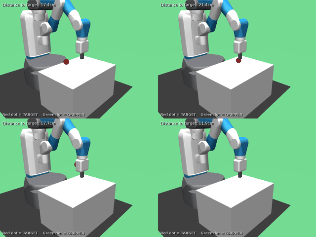
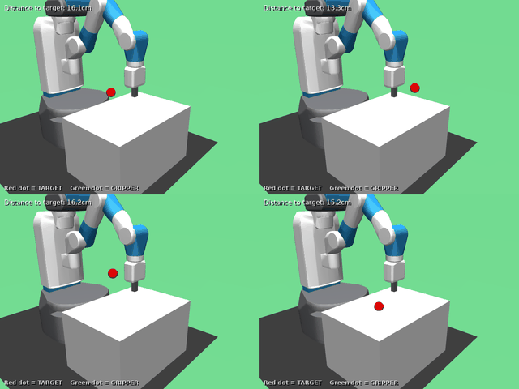

# Chapter 3: SAC on Dense Reach -- Validating the Off-Policy Stack

## What This Chapter Is Really About

Chapter 2 validated our training pipeline with PPO. We achieved 100% success on dense Reach. The infrastructure works. But PPO has a fundamental limitation: **it discards data after every update**.

**The result:** A SAC policy that learned to reach any point in 3D space, matching PPO's performance while building the off-policy machinery we need for HER.

### Early Training: Exploration (30k steps, entropy = 0.47)



*At 30k steps, the policy is still exploring. The high entropy coefficient (0.47) encourages random-ish actions. The gripper moves erratically, rarely reaching the target. Success rate: 0%.*

### Final Training: Exploitation (1M steps, entropy = 0.0004)



*At 1M steps, the policy has converged. The entropy coefficient dropped to 0.0004 (nearly deterministic). The gripper moves directly to the target. Success rate: 100%.*

**This is the entropy bonus in action:** Early training explores broadly (high entropy), late training exploits what was learned (low entropy). SAC auto-tunes this tradeoff.

---

PPO's data inefficiency is wasteful. Each transition took real simulation time to collect. PPO uses it for a few gradient steps, then throws it away. For dense-reward tasks where signal is plentiful, this inefficiency is tolerable. For sparse-reward tasks (coming in Chapter 4), it's catastrophic.

**Off-policy methods** solve this by storing transitions in a **replay buffer** and reusing them across many updates. This is dramatically more sample-efficient. But it introduces new failure modes: stale data, value overestimation, training instability.

This chapter validates the off-policy machinery on dense Reach--the same "easy" task where we know success is achievable. If SAC fails here, the bug is in our off-policy implementation, not the task difficulty.

By the end, you will have:
1. A trained SAC policy matching or exceeding PPO's performance
2. Understanding of maximum-entropy RL and why it matters
3. Replay buffer diagnostics to detect common off-policy pathologies
4. Throughput benchmarks for scaling to larger experiments

---

## Part 0: Setting the Stage

### 0.1 Why SAC After PPO?

We're not choosing SAC because it's "better"--we're building toward HER (Hindsight Experience Replay), which requires off-policy learning. The dependency chain:

```
Dense Reach + PPO (Ch 2)      -- validates training loop
        |
        v
Dense Reach + SAC (Ch 3)      -- validates off-policy machinery  <-- YOU ARE HERE
        |
        v
Sparse Reach + SAC + HER (Ch 4) -- validates goal relabeling
        |
        v
Harder tasks (Ch 5+)          -- builds on validated infrastructure
```

Each step isolates one new component. If SAC fails on dense Reach, we know the bug is in SAC, not the environment. If HER fails on sparse Reach, we know the bug is in HER, not SAC.

### 0.2 The Diagnostic Mindset (Again)

Dense Reach with SAC should achieve similar performance to PPO--both are solving the same task with the same amount of signal. If SAC performs much worse:
- Value overestimation (Q-values growing unbounded)
- Entropy collapse (exploration stopped too early)
- Replay buffer issues (stale data, wrong sampling)

The diagnostics callback we'll use catches these early.

---

## Part 1: WHY -- Maximum Entropy Reinforcement Learning

### 1.1 The Standard RL Objective (Review)

Recall from Chapter 2 that standard RL maximizes expected return:

```math
J(\theta) = \mathbb{E}\left[ \sum_{t=0}^{T} \gamma^t R_t \right]
```

This finds a policy that gets high reward. But there's a subtle problem: **the optimal policy is deterministic.** Once you know the best action for each state, why ever do anything else?

### 1.2 Why Determinism Is Actually a Problem

In theory, a deterministic optimal policy is fine. In practice, it causes issues:

**Problem 1: Exploration Dies**

A deterministic policy exploits what it knows. If the current best action gets reward +10, the policy commits to it. But what if there's an action that would get +20, which the policy has never tried because it stopped exploring?

**Problem 2: Brittleness**

A policy that commits fully to one action per state is fragile. Small perturbations (observation noise, model mismatch) can push it into unfamiliar states where it has no idea what to do.

**Problem 3: Training Instability**

When the policy is nearly deterministic, small value estimate changes cause large behavioral changes (the "winning" action flips). This amplifies noise in the training process.

### 1.3 The Maximum Entropy Objective

SAC modifies the objective to include an **entropy bonus**:

```math
J(\theta) = \mathbb{E}\left[ \sum_{t=0}^{T} \gamma^t \left( R_t + \alpha \mathcal{H}(\pi(\cdot | s_t)) \right) \right]
```

where:
- $\mathcal{H}(\pi(\cdot | s))$ = **entropy** of the policy at state $s$, measuring how "spread out" the action distribution is
- $\alpha > 0$ = **temperature** parameter, controlling the exploration-exploitation tradeoff

**Definition (Entropy).** For a continuous policy outputting a Gaussian distribution over actions, the entropy is:

```math
\mathcal{H}(\pi(\cdot | s)) = \frac{1}{2} \ln((2\pi e)^d |\Sigma|)
```

where $d$ is the action dimension and $|\Sigma|$ is the determinant of the covariance matrix. Higher entropy means the policy is more random; lower entropy means more deterministic.

**The key insight:** The optimal policy no longer commits fully to one action. Instead, it prefers actions proportionally to their Q-values:

```math
\pi^*(a | s) \propto \exp(Q^*(s, a) / \alpha)
```

This is a **Boltzmann distribution** (or "softmax" over continuous actions). High-Q actions are more likely, but low-Q actions still have some probability. The temperature $\alpha$ controls the sharpness:
- $\alpha \to 0$: deterministic (argmax)
- $\alpha \to \infty$: uniform random

### 1.4 Automatic Temperature Tuning

Choosing $\alpha$ manually is tricky--too low and you lose exploration, too high and you never exploit. SAC can learn $\alpha$ automatically by targeting a desired entropy level:

```math
\alpha^* = \arg\min_\alpha \mathbb{E}_{a \sim \pi}\left[ -\alpha \log \pi(a|s) - \alpha \bar{\mathcal{H}} \right]
```

where $\bar{\mathcal{H}}$ is the **target entropy** (typically set to $-\dim(\mathcal{A})$, the negative action dimension).

**Translation:** "Adjust $\alpha$ so that the policy's entropy stays near $\bar{\mathcal{H}}$."

This means SAC adapts its exploration automatically. Early in training, when the policy is uncertain, entropy is high naturally. Late in training, when the policy is confident, $\alpha$ decreases to allow more exploitation.

### 1.5 Why This Matters for Robotics

In robotics, brittleness kills. A policy that works perfectly in simulation but fails on real hardware is useless. Maximum entropy encourages:

1. **Diverse training data**: The policy explores many actions, seeing more of the state space
2. **Robust behaviors**: The policy doesn't commit fully to any single action, making it more tolerant to noise
3. **Smoother training**: The Boltzmann-style policy changes gradually as Q-values change

---

## Part 2: HOW -- The SAC Algorithm

### 2.1 The Components

SAC maintains five networks (in Stable Baselines 3's implementation):

| Network | Purpose | Updates |
|---------|---------|---------|
| **Actor** $\pi_\theta$ | Maps states to action distributions | Policy gradient |
| **Critic 1** $Q_{\phi_1}$ | Estimates Q-values | Bellman backup |
| **Critic 2** $Q_{\phi_2}$ | Second Q estimate (reduces overestimation) | Bellman backup |
| **Target Critic 1** $Q_{\bar{\phi}_1}$ | Stable target for critic updates | Polyak averaging |
| **Target Critic 2** $Q_{\bar{\phi}_2}$ | Stable target for critic updates | Polyak averaging |

**Why two critics?** Q-learning tends to overestimate values because we take a max over noisy estimates. Using two critics and taking the minimum reduces this bias. This is called **clipped double Q-learning**.

**Why target networks?** If we update the critic using its own predictions as targets, we get a moving target problem. Target networks are slow-moving copies that provide stable targets:

```math
\bar{\phi} \leftarrow \tau \phi + (1 - \tau) \bar{\phi}
```

with $\tau = 0.005$ typically (slow updates).

### 2.2 The Training Loop

```
repeat:
    1. Collect transitions using current policy, store in replay buffer
    2. Sample minibatch from replay buffer
    3. Update critics using Bellman backup (target uses min of two Q-targets)
    4. Update actor to maximize Q + entropy
    5. Update temperature alpha (if auto-tuning)
    6. Soft-update target networks
```

**Step 1: Collect Data**

Unlike PPO, SAC collects data continuously. Each step:
1. Get action from policy (with sampling for exploration)
2. Execute in environment
3. Store $(s, a, r, s', done)$ in replay buffer

The replay buffer is circular--when full, old transitions are overwritten.

**Step 2: Sample Minibatch**

Uniformly sample `batch_size` transitions from the buffer. This is where sample reuse happens--the same transition might be sampled many times across training.

**Step 3: Update Critics**

For each critic, minimize the Bellman error:

```math
L(\phi_i) = \mathbb{E}_{(s,a,r,s') \sim \mathcal{B}}\left[ \left( Q_{\phi_i}(s, a) - y \right)^2 \right]
```

where the target $y$ is:

```math
y = r + \gamma (1 - done) \left[ \min_{j=1,2} Q_{\bar{\phi}_j}(s', a') - \alpha \log \pi(a' | s') \right]
```

with $a' \sim \pi(\cdot | s')$.

**Translation:** "The Q-value of $(s, a)$ should equal the reward plus the (discounted, entropy-adjusted) value of the next state."

**Step 4: Update Actor**

Maximize expected Q-value plus entropy:

```math
L(\theta) = \mathbb{E}_{s \sim \mathcal{B}, a \sim \pi_\theta}\left[ \alpha \log \pi_\theta(a | s) - \min_{i=1,2} Q_{\phi_i}(s, a) \right]
```

**Translation:** "Choose actions that have high Q-values while maintaining high entropy."

### 2.3 Key Differences from PPO

| Aspect | PPO | SAC |
|--------|-----|-----|
| Data reuse | None (on-policy) | Extensive (replay buffer) |
| Exploration | Via entropy bonus (optional) | Via entropy bonus (core) |
| Sample efficiency | Low | High |
| Stability | High (clipped updates) | Medium (moving targets) |
| Complexity | Lower | Higher (more networks) |

### 2.4 Key Hyperparameters

| Parameter | Default | What It Controls |
|-----------|---------|------------------|
| `buffer_size` | 1,000,000 | Replay buffer capacity |
| `batch_size` | 256 | Minibatch size for updates |
| `learning_starts` | 10,000 | Steps before training begins |
| `tau` | 0.005 | Target network update rate |
| `ent_coef` | "auto" | Entropy temperature (auto-tuned) |
| `learning_rate` | 3e-4 | Gradient step size |

---

## Part 3: WHAT -- Running the Experiment

### 3.1 The One-Command Version

```bash
bash docker/dev.sh python scripts/ch03_sac_dense_reach.py all --seed 0
```

This runs training (with diagnostics), evaluation, and comparison to PPO.

For faster iteration (~2 minutes):

```bash
bash docker/dev.sh python scripts/ch03_sac_dense_reach.py train --total-steps 100000
```

### 3.2 What to Expect

Training progress milestones for SAC (note: `learning_starts=10000` means no training for first 10k steps):

| Timesteps | Success Rate | What's Happening |
|-----------|--------------|------------------|
| 0-10k | 0% | Collecting random data (no training yet) |
| 10k-50k | 0-5% | Training begins, Q-values learning |
| 50k-150k | 20-60% | Rapid improvement, entropy decreasing |
| 150k-400k | 80-99% | Policy converging |
| 400k-1M | 100% | Fine-tuning, entropy near zero |

Our test run achieved:
- **100% success rate** after ~300k steps
- **18.6mm average goal distance** (well within 50mm threshold)
- **~594 steps/second** throughput on NVIDIA GB10
- **Entropy coefficient**: dropped from 0.47 to 0.0004 (policy became deterministic)

### 3.2 What the Diagnostics Callback Logs

Our custom `SACDiagnosticsCallback` logs to TensorBoard:

| Metric | What It Means | Healthy Range |
|--------|---------------|---------------|
| `replay/q1_mean`, `q2_mean` | Average Q-values | Should stabilize, not explode |
| `replay/q_min_mean` | Min of two Q-values | Tracks actual value estimates |
| `replay/ent_coef` | Temperature $\alpha$ | Should decrease over training |
| `replay/reward_mean` | Average reward in buffer | Task-dependent |
| `replay/goal_distance_mean` | How far from goals | Should decrease |
| `replay/goal_within_threshold` | Fraction within success | Should increase |

### 3.3 What to Watch For

**Q-Value Behavior:**
- Healthy: Q-values stabilize in a reasonable range (we observed `q_min_mean ~ -1.5`)
- Unhealthy: Q-values grow unbounded (>100, continuing to increase)

Our run showed Q-values starting positive (~18 at 30k steps during random exploration) then settling to ~-1.5 as the policy learned. This is healthy--the critic learned accurate value estimates.

**Entropy Coefficient:**
- Healthy: Starts high, gradually decreases (we observed: 0.47 -> 0.0004)
- Unhealthy: Drops to near-zero in first 10k steps (exploration collapsed)

Our run showed gradual decrease over 1M steps, indicating the auto-tuning worked correctly. The final value (0.0004) means the policy became nearly deterministic--appropriate for a solved task.

**Goal Distance (in replay buffer):**
- Note: This shows the *average* distance across the entire buffer, not current policy performance
- Our run showed ~0.20m mean distance (historical average including early random data)
- Current policy performance is measured by `rollout/success_rate` and evaluation metrics

### 3.4 Throughput Scaling

Off-policy methods can benefit from parallel environments, but the relationship is complex (more envs = more data, but also more stale):

```bash
bash docker/dev.sh python scripts/ch03_sac_dense_reach.py throughput --n-envs-list 1,2,4,8,16
```

This measures steps/second for different `n_envs` values. Expect:
- Near-linear scaling up to some point
- Diminishing returns as CPU becomes the bottleneck
- Sweet spot typically around 4-16 envs for SAC

### 3.5 Actual Results

On FetchReachDense-v4 with 1M steps (NVIDIA GB10):

| Metric | PPO (Ch 2) | SAC (Actual) |
|--------|------------|--------------|
| Success Rate | 100% | 100% |
| Mean Return | -0.40 | -1.06 |
| Final Distance | 4.6mm | 18.6mm |
| Action Smoothness | 1.40 | 1.68 |
| Training Time | ~6 min | ~28 min |
| Throughput | ~1300 fps | ~594 fps |

**Analysis:**
- Both achieve 100% success--the off-policy stack is validated
- SAC has higher final distance (18.6mm vs 4.6mm) but still well within the 50mm success threshold
- SAC is slower due to more network updates (actor + 2 critics + 2 targets) per step
- SAC's slightly less smooth actions reflect the entropy bonus encouraging exploration

### 3.6 Understanding GPU Utilization

You may notice low GPU utilization (~5-10%) during training:

```
$ nvidia-smi dmon -s u
# gpu     sm    mem
    0      7      0
```

**This is expected for RL training.** The bottleneck is CPU, not GPU:

| Component | Runs On | Time Fraction |
|-----------|---------|---------------|
| MuJoCo physics simulation | CPU | ~60-70% |
| Environment step/reset | CPU | ~10-15% |
| Neural network forward | GPU | ~5-10% |
| Neural network backward | GPU | ~10-15% |
| Replay buffer operations | CPU | ~5% |

With small batch sizes (256) and simple MLPs, GPU operations complete in microseconds. The GPU idles while waiting for CPU-bound simulation. This is why throughput (~600 fps) is limited by CPU, not GPU.

**To increase GPU utilization:**
- Larger batch sizes (but diminishing returns for small networks)
- Multiple parallel training workers (adds complexity)
- Vision-based policies with CNNs (Week 8+)

For our curriculum, ~600 fps is sufficient. Don't optimize prematurely.

---

### 3.7 Generating Demo Videos

To visualize your trained policy, use the video generation script:

```bash
# Generate videos from SAC checkpoint
bash docker/dev.sh python scripts/generate_demo_videos.py \
    --ckpt checkpoints/sac_FetchReachDense-v4_seed0.zip \
    --env FetchReachDense-v4 \
    --n-episodes 5 \
    --out videos/sac_reach_demo \
    --grid \
    --gif
```

This creates:
- `videos/sac_reach_demo.mp4` - Compilation of all episodes
- `videos/sac_reach_demo_grid.mp4` - 2x2 grid showing 4 episodes simultaneously
- `videos/sac_reach_demo_grid.gif` - GIF version for documentation/social media

**Video annotations:** Each frame shows:
- **Distance to target** - Real-time distance in centimeters
- **"TARGET REACHED!"** - Green text when within 5cm threshold
- **Legend** - Red dot = target position, Green dot = gripper position

The script automatically:
1. Loads the trained model (works with PPO, SAC, or TD3)
2. Enlarges the target sphere for visibility
3. Adds text overlays with goal distance
4. Creates both MP4 and GIF formats

---

## Part 4: Understanding What You Built

### 4.1 The Replay Buffer

The replay buffer is a circular array storing transitions:

```
[t_0, t_1, t_2, ..., t_{n-1}, t_n, t_{n+1}, ...]
 ^-- oldest                          ^-- newest
```

When full, new transitions overwrite the oldest. This means:
- Recent experience is always available
- Very old experience is eventually forgotten
- Buffer size controls the "memory horizon"

For 1M buffer and 1M training steps, every transition is seen roughly once on average. Increase buffer size for longer memory; decrease for faster adaptation.

### 4.2 The Min-Q Trick

When computing the target for critic updates, SAC uses:

```math
\min_{j=1,2} Q_{\bar{\phi}_j}(s', a')
```

This seems pessimistic--why take the minimum? Because Q-learning systematically overestimates:

```math
\mathbb{E}[\max(Q_1, Q_2)] \geq \max(\mathbb{E}[Q_1], \mathbb{E}[Q_2])
```

Taking the min counteracts this bias, leading to more stable training.

### 4.3 The Squashed Gaussian

SAC uses a "squashed Gaussian" for the policy:
1. Sample from a Gaussian: $z \sim \mathcal{N}(\mu, \sigma^2)$
2. Squash through tanh: $a = \tanh(z)$

This ensures actions are bounded (important for robotics with joint limits). The log probability calculation accounts for the squashing via a Jacobian correction.

---

## Part 5: Exercises

### Exercise 3.1: Reproduce the Baseline

Run SAC on FetchReachDense-v4 and verify >95% success rate:

```bash
bash docker/dev.sh python scripts/ch03_sac_dense_reach.py all --seed 0
```

### Exercise 3.2: Compare Learning Curves

Open TensorBoard and compare PPO vs SAC:

```bash
bash docker/dev.sh tensorboard --logdir runs --bind_all
```

Questions to answer:
- Which reaches high success faster?
- How do the value loss curves differ?
- What happens to SAC's entropy coefficient over training?

### Exercise 3.3: Throughput Analysis

Run the throughput experiment:

```bash
bash docker/dev.sh python scripts/ch03_sac_dense_reach.py throughput
```

Plot steps/sec vs n_envs. Where does scaling stop being linear?

### Exercise 3.4: Q-Value Analysis (Written)

Watch the Q-value metrics in TensorBoard. Answer:
1. Do Q1 and Q2 diverge significantly, or stay close?
2. What is the typical range of Q-values for this task?
3. How would you detect Q-value overestimation if it occurred?

### Exercise 3.5: Temperature Ablation

Train with fixed entropy coefficients instead of auto-tuning:

```bash
# In train.py, modify ent_coef to a fixed value:
# ent_coef=0.1 (high exploration)
# ent_coef=0.01 (medium)
# ent_coef=0.001 (low exploration)
```

How does fixed vs auto-tuned entropy affect:
- Final performance?
- Training stability?
- Time to convergence?

---

## Part 6: Common Failures and Solutions

### "Q-values explode (>1000)"

**Symptom:** `replay/q_min_mean` keeps growing without bound.

**Cause:** Overestimation feedback loop. Q-targets use overestimated Q-values, which train the critic to overestimate further.

**Solutions:**
1. Verify rewards are bounded (FetchReachDense: [-1, 0])
2. Check discount factor (should be <1, typically 0.99)
3. Reduce learning rate
4. Verify target networks are updating (tau should be small)

### "Entropy coefficient goes to zero immediately"

**Symptom:** `replay/ent_coef` drops to <0.01 within first 10k steps.

**Cause:** Target entropy too low, or policy collapsed to near-deterministic.

**Solutions:**
1. Increase target entropy (default is -dim(action))
2. Check action space bounds (if very wide, entropy scale changes)
3. Use fixed entropy coefficient initially to debug

### "Success rate stalls below 50%"

**Symptom:** Learning plateaus well below PPO baseline.

**Cause:** Often insufficient exploration or replay buffer issues.

**Solutions:**
1. Check entropy coefficient isn't too low
2. Verify `learning_starts` isn't too high (not using early data)
3. Check batch size (too small = high variance, too large = slow updates)

### "Training is much slower than PPO"

**Expected:** SAC is slower per-step (more networks to update).

**Unexpected slowness causes:**
1. Buffer operations (should be O(1) for sampling)
2. GPU memory (buffer can be large)
3. Too many gradient steps per env step

---

## Part 7: Looking Ahead

With SAC validated on dense Reach, we've confirmed:
1. Replay buffer correctly stores and samples transitions
2. Dual critics work without divergence
3. Entropy tuning behaves as expected
4. Off-policy learning achieves good performance

**Chapter 4** introduces HER (Hindsight Experience Replay) for sparse rewards. The key insight: a failed trajectory to goal $g$ is a successful trajectory to whatever goal we actually reached. HER relabels transitions to manufacture success signal from failure.

This requires off-policy learning (SAC or TD3)--on-policy methods like PPO cannot use HER because they can't reuse relabeled data. Our validated SAC stack is the foundation.

---

## References

1. Haarnoja, T., Zhou, A., Abbeel, P., & Levine, S. (2018). Soft Actor-Critic: Off-Policy Maximum Entropy Deep Reinforcement Learning with a Stochastic Actor. ICML.

2. Haarnoja, T., Zhou, A., Hartikainen, K., Tucker, G., Ha, S., Tan, J., Kumar, V., Zhu, H., Gupta, A., Abbeel, P., & Levine, S. (2018). Soft Actor-Critic Algorithms and Applications. arXiv:1812.05905.

3. Fujimoto, S., van Hoof, H., & Meger, D. (2018). Addressing Function Approximation Error in Actor-Critic Methods. ICML. (TD3 paper, introduces clipped double-Q)

4. Stable Baselines3 SAC Documentation: https://stable-baselines3.readthedocs.io/en/master/modules/sac.html
