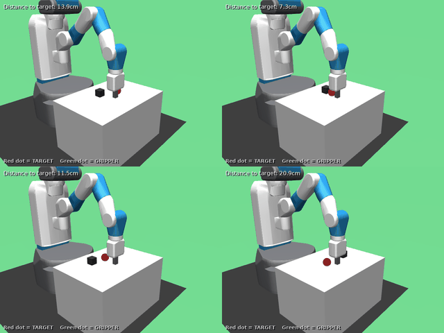
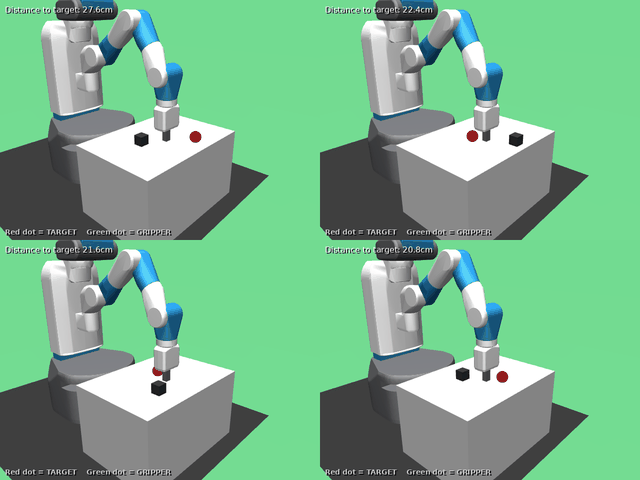
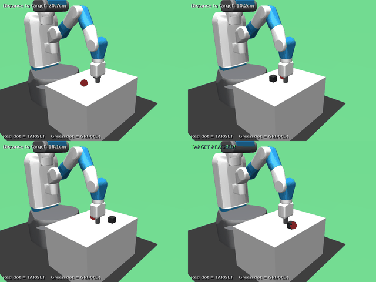

# Chapter 4: Sparse Reach + Push -- Introduce HER Where It Matters

> **Week 4 Goal:** Demonstrate that Hindsight Experience Replay (HER) is the difference-maker on sparse goal-conditioned tasks.

---

## WHY: The Sparse Reward Problem

In Chapter 3, we trained SAC on `FetchReachDense-v4`, where every timestep provides a shaped reward signal proportional to the distance to the goal. The agent received continuous feedback: "you're getting warmer" or "you're getting colder." This made learning straightforward.

Now we face the real challenge: **sparse rewards**.

### What "Sparse" Means in Gymnasium-Robotics

In sparse Fetch environments (`FetchReach-v4`, `FetchPush-v4`, `FetchPickAndPlace-v4`), the reward function is:

$$
R(s, a, g) = \begin{cases}
0 & \text{if } \|g_{\text{achieved}} - g_{\text{desired}}\| < \epsilon \\
-1 & \text{otherwise}
\end{cases}
$$

where $\epsilon = 0.05$ meters (5 cm) is the success threshold.

**The problem:** The agent receives $R = -1$ for almost every transition until it accidentally succeeds. With random exploration, this might never happen -- or happen so rarely that the agent cannot learn from it.

### Why Standard RL Fails on Sparse Goals

Consider training SAC without HER on sparse Reach:

1. **Initial exploration is random.** The gripper moves chaotically.
2. **Most episodes fail.** The gripper rarely lands within 5cm of the goal by chance.
3. **All transitions have reward $-1$.** The critic learns: "everything is equally bad."
4. **No gradient signal for improvement.** Without reward variation, the policy has no direction to improve.

This is not a hyperparameter problem -- it is a **structural limitation** of standard RL with sparse rewards.

### The Key Insight: Failed Trajectories Contain Information

Here is the insight that makes HER work:

> A trajectory that fails to reach goal $g$ is a **successful demonstration** of how to reach wherever it ended up.

If the gripper tried to reach position $(0.3, 0.2, 0.1)$ but ended at $(0.5, 0.4, 0.15)$, we have evidence that the executed actions lead to $(0.5, 0.4, 0.15)$. We can **relabel** the trajectory: pretend the goal was $(0.5, 0.4, 0.15)$ all along, and now we have a successful episode with reward 0.

This is Hindsight Experience Replay.

---

## HOW: Hindsight Experience Replay (HER)

### The Relabeling Strategy

For each transition $(s_t, a_t, r_t, s_{t+1}, g)$ stored in the replay buffer, HER also stores relabeled versions:

1. **Original transition:** goal = $g$ (the intended goal)
2. **Relabeled transitions:** goal = $g'$ (substituted goals)

The substituted goals $g'$ come from the same trajectory. Common strategies:

| Strategy | Description |
|----------|-------------|
| `future` | Sample $g'$ from achieved goals at timesteps $t' > t$ in the same episode |
| `final` | Use only the final achieved goal $g' = g_{\text{achieved}}(s_T)$ |
| `episode` | Sample $g'$ from any achieved goal in the episode |

**Why `future` works best:** It creates more relabeled transitions (one for each future timestep), and these goals are "reachable" from the current state -- the agent just demonstrated it can get there.

### The `n_sampled_goal` Parameter

For each original transition, HER creates `n_sampled_goal` additional relabeled transitions. The default is 4, meaning:

- 1 original transition (goal = intended)
- 4 relabeled transitions (goal = sampled achieved goals)

This 5x expansion of the replay buffer is how HER manufactures dense reward signal from sparse feedback.

### Why HER Requires Off-Policy Learning

HER only works with **off-policy** algorithms (SAC, TD3, DDPG) because:

1. **Relabeling changes the reward.** The relabeled transition has a different reward than what the agent actually experienced.
2. **Off-policy methods don't care.** They can learn from any transition, regardless of which policy generated it.
3. **On-policy methods (PPO) cannot use relabeled data.** They require transitions from the current policy.

This is why the syllabus builds SAC mastery (Weeks 2-3) before introducing HER (Week 4).

---

## BUILD IT: HER Relabeling in Code

This section shows how HER's goal relabeling maps to code. We use pedagogical implementations from `scripts/labs/her_relabeler.py`—these are for understanding, not production.

### Goal Sampling Strategies

The "future" strategy samples achieved goals from timesteps after the current transition:

```python
--8<-- "scripts/labs/her_relabeler.py:goal_sampling"
```

**Key insight:** The `future` strategy ensures temporal consistency—we only relabel with goals the agent *actually reached* from states similar to the current one.

### Relabeling a Transition

The core HER operation: substitute a new goal and recompute the reward:

```python
--8<-- "scripts/labs/her_relabeler.py:relabel_transition"
```

**Key mapping:**

| Concept | Code | Meaning |
|---------|------|---------|
| Original goal | `transition.desired_goal` | What we were trying to reach |
| Achieved goal | `transition.achieved_goal` | Where we actually ended up |
| Relabeled goal | `new_goal` | Substitute this as the "desired" goal |
| New reward | `compute_reward_fn(achieved, new_goal)` | Did achieved match the new goal? |

**Crucial:** The `achieved_goal` stays the same—only `desired_goal` changes. If achieved == new desired, the transition becomes a "success."

### The Data Amplification Effect

Processing an episode with HER dramatically increases the success rate in the replay buffer:

```python
--8<-- "scripts/labs/her_relabeler.py:her_buffer_insert"
```

**Without HER:** Nearly 0% of transitions have positive reward (sparse signal).
**With HER:** Many relabeled transitions are "successes" because achieved == relabeled goal.

### Verify the Lab

Run the from-scratch implementation's sanity checks:

```bash
bash docker/dev.sh python scripts/labs/her_relabeler.py --verify
```

Expected output:
- Goal sampling produces correct number of goals
- Relabeling with own achieved goal produces reward=0 (success)
- HER processing increases success rate in synthetic data (0% → ~16%)

This lab is **not** how we train policies—SB3's HER wrapper handles that. The lab shows *what* relabeling does to your data.

### Exercises: Modify and Observe

**Exercise: Goal Sampling Strategy Comparison**

Run the demo to see how different strategies affect success rates:

```bash
bash docker/dev.sh python scripts/labs/her_relabeler.py --demo
```

*Observe:* The `future`, `final`, and `episode` strategies produce different success rates. Why does `future` typically work best?

**Exercise: Relabeling Ratio (k)**

In `process_episode_with_her()`, change `k=4` to different values:

```python
# Try: k=1, k=4, k=8, k=16
```

*Question:* How does the success fraction change with k? What's the tradeoff between more relabeled data and data quality?

**Exercise: HER Ratio**

Change `her_ratio=0.8` to different values:

```python
# Try: her_ratio=0.0 (no HER), her_ratio=0.5, her_ratio=1.0 (all relabeled)
```

*Question:* With `her_ratio=0.0`, you get pure sparse reward learning. With `her_ratio=1.0`, you get maximum relabeling. Why might 0.8 be a good balance?

**Exercise: Understand Why HER Only Gets ~16% Success**

The verification shows ~16% success rate on synthetic data. This seems low—why not higher?

*Hint:* The synthetic trajectory uses random actions, so achieved goals are scattered randomly. With a *trained* policy that moves toward goals, future achieved goals would be closer to the current state, making more relabeled transitions successful. HER amplifies competence—it doesn't create it from nothing.

---

## WHAT: Experiments and Expected Results (Run It)

### Running the Experiments

All experiments run through Docker via the `docker/dev.sh` wrapper. This ensures reproducible environments with correct GPU access, MuJoCo rendering, and Python dependencies.

#### Quick Start: Full Pipeline

```bash
# FetchReach-v4: ~1 hour for all 6 runs (default settings work well)
bash docker/dev.sh python scripts/ch04_her_sparse_reach_push.py env-all \
    --env FetchReach-v4 --seeds 0,1,2 --total-steps 500000

# FetchPush-v4: ~3 hours for all 6 runs (needs fixed entropy for reliable learning)
bash docker/dev.sh python scripts/ch04_her_sparse_reach_push.py env-all \
    --env FetchPush-v4 --seeds 0,1,2 --total-steps 2000000 --ent-coef 0.05
```

The `env-all` command runs the complete pipeline:
1. Train SAC without HER (3 seeds)
2. Evaluate each no-HER checkpoint (100 episodes each)
3. Train SAC with HER (3 seeds)
4. Evaluate each HER checkpoint (100 episodes each)
5. Generate comparison report

**Note:** Legacy `reach-all` and `push-all` commands still work for backwards compatibility.

#### Individual Commands

For more control, run steps separately:

```bash
# Train a single model
bash docker/dev.sh python scripts/ch04_her_sparse_reach_push.py train \
    --env FetchPush-v4 --seed 0 --total-steps 500000        # no-HER

bash docker/dev.sh python scripts/ch04_her_sparse_reach_push.py train \
    --env FetchPush-v4 --her --seed 0 --total-steps 500000  # with HER

# Train with fixed entropy (recommended for sparse Push)
bash docker/dev.sh python scripts/ch04_her_sparse_reach_push.py train \
    --env FetchPush-v4 --her --seed 0 --total-steps 2000000 --ent-coef 0.05

# Evaluate a checkpoint
bash docker/dev.sh python scripts/ch04_her_sparse_reach_push.py eval \
    --ckpt checkpoints/sac_her_FetchPush-v4_seed0.zip

# Compare results across seeds
bash docker/dev.sh python scripts/ch04_her_sparse_reach_push.py compare \
    --env FetchPush-v4 --seeds 0,1,2
```

#### Long-Running Jobs with tmux

Training takes 10-15 minutes per run. For the full pipeline (~3 hours for Push), use tmux:

```bash
# Start a persistent session
tmux new -s week4

# Inside tmux, run the experiments
bash docker/dev.sh python scripts/ch04_her_sparse_reach_push.py env-all \
    --env FetchPush-v4 --seeds 0,1,2 --ent-coef 0.05 --total-steps 2000000

# Detach: Ctrl-b d
# Reattach later: tmux attach -t week4
```

#### Expected Training Time

| Environment | Steps | Time per run | Total (6 runs) |
|-------------|-------|--------------|----------------|
| FetchReach-v4 | 500k | ~10 min | ~60 min |
| FetchPush-v4 | 500k | ~14 min | ~85 min |
| FetchPush-v4 | 1M | ~28 min | ~170 min |

*Times measured on DGX with RTX A100, ~600 fps throughput.*

---

### Experiment 1: Sparse Reach -- HER vs No-HER

**Hypothesis:** SAC without HER will struggle on `FetchReach-v4`; SAC with HER will succeed more reliably.

```bash
# Full pipeline: train both, evaluate, compare (3 seeds each)
bash docker/dev.sh python scripts/ch04_her_sparse_reach_push.py reach-all --seeds 0,1,2 --total-steps 500000

# Or train individually:
# No-HER baseline
bash docker/dev.sh python scripts/ch04_her_sparse_reach_push.py train \
    --env FetchReach-v4 --seed 0 --total-steps 500000

# With HER
bash docker/dev.sh python scripts/ch04_her_sparse_reach_push.py train \
    --env FetchReach-v4 --her --seed 0 --total-steps 500000
```

#### Actual Results (FetchReach-v4, 3 seeds, 500k steps)

| Metric | No-HER | HER | Delta |
|--------|--------|-----|-------|
| Success Rate | 96.0% +/- 8.0% | 100.0% +/- 0.0% | +4.0% |
| Return (mean) | -2.92 +/- 2.36 | -1.68 +/- 0.02 | +1.24 |
| Final Distance | 0.0195 +/- 0.009 | 0.0170 +/- 0.007 | -0.003 |

#### Analysis: Why Reach Shows Weak Separation

**This is an important finding:** FetchReach-v4 is too easy to demonstrate HER's value clearly.

**Why does no-HER work so well on Reach?**

1. **Small goal space:** The gripper workspace is only ~15cm³. Random exploration frequently enters the success threshold (5cm) by chance.

2. **No object manipulation:** The gripper just needs to move itself -- no physics interactions, no contact forces, no object dynamics.

3. **Short horizon:** Episodes are 50 steps. With 8 parallel envs and 500k steps, that's ~12,500 episodes -- plenty for random success accumulation.

4. **Forgiving success threshold:** 5cm is relatively large compared to the workspace.

**The pedagogical point:** Reach is useful for validating that HER *doesn't hurt* (HER achieves 100% vs 96% for no-HER), but it fails to show HER's transformative effect. We need a harder task.

**This is why we proceed to FetchPush-v4.**

### Experiment 2: Sparse Push -- Where HER Matters

Push is dramatically harder than Reach because:

1. **Indirect control:** The gripper must contact and push the object -- actions affect the object indirectly through physics.
2. **Object dynamics:** The object slides on the table with friction, momentum, and potentially overshooting.
3. **Coordinated behavior:** Success requires approach → contact → push → stop, all in sequence.
4. **Larger state space:** Both gripper AND object positions matter.

```bash
# Full pipeline for Push (recommended settings, ~3 hours)
bash docker/dev.sh python scripts/ch04_her_sparse_reach_push.py push-all \
    --seeds 0,1,2 --total-steps 2000000 --ent-coef 0.05
```

**Why no-HER should fail on Push:**

- Random exploration rarely pushes the object to the goal by chance
- Without accidental successes, the replay buffer contains only $R=-1$ transitions
- The critic cannot distinguish "almost succeeded" from "completely failed"
- No gradient signal → no learning

**Why HER should succeed:**

- Every trajectory shows how to push the object *somewhere*
- Relabeling creates successful demonstrations: "you pushed it to $(x,y)$, let's pretend that was the goal"
- The agent learns push dynamics from its own failures
- Eventually generalizes to arbitrary goals

**Expected results (with sufficient training and correct hyperparameters):**

| Method | Success Rate | Notes |
|--------|--------------|-------|
| SAC (no HER) | ~0-5% | Almost never succeeds; no learning |
| SAC + HER (best config) | **99.4% +/- 0.9%** | ent=0.05, gamma=0.95 (5 seeds) |
| **Delta** | **>94 pp** | **This is the "clear separation" we seek** |

#### Actual Results: Initial Attempt (500k steps)

Our first experiment with 500k steps showed **no separation**:

```
Metric                    |               No-HER |                  HER |        Delta
-------------------------------------------------------------------------------------
Success Rate              |        5.0% +/- 0.0% |        5.0% +/- 0.0% |        +0.0%
```

**Diagnosis:** Insufficient training, not a bug.

We verified the setup was correct:
- ✅ HER config: `"her": true`, `n_sampled_goal: 4`, `strategy: future`
- ✅ Correct env: `FetchPush-v4` (sparse, not Dense)
- ✅ No-HER baseline: 5% (expected 0-5%)
- ⚠️ HER showed learning during training (peaked at 10-12%) but oscillated and didn't converge

#### From Single Runs to Systematic Evidence

Our initial 98% result (Attempt 3 above) felt like a victory. But one seed at 98% is not evidence -- it is an anecdote. Is `ent_coef=0.1` really optimal? Is `gamma=0.98` the right choice? Is `n_sampled_goal=8` helping?

To answer rigorously, we ran a **systematic hyperparameter sweep**: 24 configurations, 5 seeds each, 120 total runs on FetchPush-v4 at 2M steps. This section presents the results.

#### Sweep Design

We varied four factors in a full factorial grid:

| Factor | Levels | Rationale |
|--------|--------|-----------|
| `ent_coef` | 0.05, 0.1, 0.2 | Fixed entropy values spanning conservative to aggressive exploration |
| `n_sampled_goal` | 4, 8 | Default vs. denser relabeling |
| `learning_starts` | 1000, 5000 | Earlier vs. later critic warmup |
| `gamma` | 0.95, 0.98 | Shorter vs. longer effective horizon |

**Total: 3 x 2 x 2 x 2 = 24 configurations x 5 seeds = 120 runs.**

Each run: SAC + HER on FetchPush-v4, 2M steps, seeds {0, 1, 2, 42, 77}. Approximately 140 GPU-hours on DGX (RTX A100).

**Reproducing the sweep:**

```bash
# Full sweep (~140 GPU-hours, parallelizable)
bash docker/dev.sh python scripts/ch04_sweep.py run --parallel 2

# Or download pre-computed results from GitHub Release:
gh release download v0.4-sweep-checkpoints --pattern "ch04_sweep_all_checkpoints.tar.gz"
tar xzf ch04_sweep_all_checkpoints.tar.gz
```

### Sweep Results: 120 Runs, 24 Configurations

#### The Winner: Simplest Config

The best configuration across all 120 runs is the **simplest** one:

| Parameter | Value |
|-----------|-------|
| `ent_coef` | 0.05 |
| `n_sampled_goal` | 4 (default) |
| `learning_starts` | 1000 |
| `gamma` | **0.95** |

**Result: 99.4% +/- 0.9% (5 seeds, 95% CI: [98.3%, 100.5%])**

This surprised us. We had been recommending `gamma=0.98`, `n_sampled_goal=8`, and `learning_starts=5000` -- all wrong. The sweep showed that the simplest defaults with a lower gamma and lower entropy coefficient outperform every other combination.

<details>
<summary><strong>Full ranked table (all 24 configurations)</strong></summary>

| Rank | ent_coef | nsg | ls | gamma | Mean SR | Std | Min | Max |
|------|----------|-----|------|-------|---------|-----|-----|-----|
| 1 | 0.05 | 4 | 1000 | 0.95 | **99.4%** | 0.9% | 98% | 100% |
| 2 | 0.10 | 4 | 1000 | 0.95 | 97.8% | 2.6% | 95% | 100% |
| 3 | 0.05 | 8 | 1000 | 0.95 | 97.4% | 1.8% | 95% | 99% |
| 4 | 0.05 | 8 | 5000 | 0.95 | 97.2% | 3.1% | 92% | 100% |
| 5 | 0.10 | 8 | 5000 | 0.95 | 97.2% | 3.1% | 92% | 100% |
| 6 | 0.05 | 4 | 5000 | 0.95 | 96.6% | 6.7% | 85% | 100% |
| 7 | 0.10 | 8 | 1000 | 0.95 | 96.2% | 2.9% | 93% | 100% |
| 8 | 0.10 | 4 | 5000 | 0.95 | 96.0% | 3.1% | 92% | 99% |
| 9 | 0.05 | 8 | 1000 | 0.98 | 94.6% | 3.6% | 90% | 98% |
| 10 | 0.10 | 8 | 5000 | 0.98 | 94.6% | 2.9% | 91% | 98% |
| 11 | 0.05 | 8 | 5000 | 0.98 | 93.8% | 6.2% | 84% | 100% |
| 12 | 0.10 | 4 | 5000 | 0.98 | 87.2% | 4.7% | 80% | 92% |
| 13 | 0.05 | 4 | 1000 | 0.98 | 86.8% | 6.1% | 76% | 92% |
| 14 | 0.20 | 4 | 5000 | 0.95 | 85.6% | 10.7% | 71% | 96% |
| 15 | 0.20 | 4 | 1000 | 0.95 | 85.2% | 8.1% | 75% | 95% |
| 16 | 0.10 | 8 | 1000 | 0.98 | 77.4% | 10.2% | 63% | 88% |
| 17 | 0.10 | 4 | 1000 | 0.98 | 80.6% | 14.5% | 57% | 95% |
| 18 | 0.05 | 4 | 5000 | 0.98 | 81.2% | 14.6% | 66% | 99% |
| 19 | 0.20 | 8 | 5000 | 0.95 | 73.0% | 20.7% | 37% | 95% |
| 20 | 0.20 | 8 | 1000 | 0.95 | 76.8% | 9.3% | 68% | 90% |
| 21 | 0.20 | 8 | 5000 | 0.98 | 75.8% | 11.3% | 59% | 88% |
| 22 | 0.20 | 8 | 1000 | 0.98 | 65.8% | 23.4% | 30% | 95% |
| 23 | 0.20 | 4 | 5000 | 0.98 | 64.8% | 20.9% | 45% | 89% |
| 24 | 0.20 | 4 | 1000 | 0.98 | 64.0% | 20.3% | 42% | 89% |

</details>

#### Factor-Level Marginal Analysis

The marginal analysis averages over all other factors to isolate each factor's independent contribution. This is the most important table in the chapter:

| Factor | Level | Mean SR | Delta |
|--------|-------|---------|-------|
| **gamma** | **0.95** | **91.5%** | -- |
| | 0.98 | 80.5% | **-11.0 pp** |
| **ent_coef** | 0.05 | 93.4% | -- |
| | 0.10 | 90.9% | -2.5 pp |
| | 0.20 | 73.9% | **-19.5 pp** |
| **n_sampled_goal** | 4 | 85.4% | -- |
| | 8 | 86.7% | +1.2 pp |
| **learning_starts** | 1000 | 85.2% | -- |
| | 5000 | 86.9% | +1.8 pp |

**Key findings:**

1. **Gamma dominates.** Switching from 0.98 to 0.95 gains +11 pp on average. This is the single most impactful parameter.
2. **Entropy matters, but lower is better.** The jump from 0.05 to 0.2 costs 19.5 pp. Even 0.1 vs 0.05 loses 2.5 pp.
3. **n_sampled_goal and learning_starts are noise.** Their effects (+1.2 pp and +1.8 pp) are within seed variance. We had been tuning the wrong knobs.

!!! warning "The old defaults were wrong"
    Our previous recommendation was gamma=0.98, n_sampled_goal=8, learning_starts=5000.
    The sweep shows the optimal config uses gamma=0.95, n_sampled_goal=4, learning_starts=1000 --
    which happens to be the simplest possible configuration. Occam's razor wins.

#### Gamma x Entropy Interaction

The penalty for bad gamma gets worse at higher entropy. This interaction table shows why the worst configs are so bad:

| | ent=0.05 | ent=0.10 | ent=0.20 |
|--|----------|----------|----------|
| **gamma=0.95** | 97.7% | 96.8% | 80.2% |
| **gamma=0.98** | 89.1% | 85.0% | 67.6% |
| **Delta (0.98 - 0.95)** | -8.6 pp | -11.8 pp | -12.5 pp |

At low entropy (0.05), gamma=0.98 is tolerable (89.1%). But at high entropy (0.2), gamma=0.98 drops to 67.6% -- the two bad choices compound.

#### Seed Sensitivity: Good Configs Are Robust

The best configurations are not just better on average -- they are dramatically more **consistent**:

| Config | Mean SR | Seed Range (max - min) |
|--------|---------|----------------------|
| Best: ent=0.05, g=0.95, nsg=4, ls=1000 | 99.4% | **0.02** (98%-100%) |
| Worst: ent=0.2, g=0.98, nsg=4, ls=1000 | 64.0% | **0.47** (42%-89%) |

The best config's 95% CI is [98.3%, 100.5%] (width 2.2 pp). The worst config's 95% CI is [38.8%, 89.2%] (width 50.5 pp). These intervals do not overlap, confirming the difference is statistically significant.

### Mathematical Analysis: Why Gamma Dominates

The sweep showed that gamma is the dominant factor. Here we derive *why* from first principles, which helps build intuition for other tasks.

We define the following quantities:

- $\gamma \in [0, 1)$: discount factor
- $T$: episode length (50 steps for Fetch tasks)
- $T_{\text{eff}} = 1/(1 - \gamma)$: **effective horizon**, the number of steps over which rewards are meaningfully discounted
- $\alpha$: entropy coefficient (`ent_coef`)
- $\mathcal{H}(\pi)$: policy entropy (bits of randomness in action selection)
- $Q(s, a)$: critic's estimated action-value
- $\delta_t = r_t + \gamma Q(s_{t+1}, a_{t+1}) - Q(s_t, a_t)$: TD error

#### Effective Horizon Mismatch

The effective horizon tells us how far into the future the agent "looks":

$$T_{\text{eff}} = \frac{1}{1 - \gamma}$$

| $\gamma$ | $T_{\text{eff}}$ | Interpretation |
|-----------|-------------------|----------------|
| 0.95 | 20 steps | Matches task timescale (~15-25 steps for a successful push) |
| 0.98 | 50 steps | Matches full episode -- agent tries to optimize beyond the push |

When $T_{\text{eff}}$ matches the task timescale, the critic focuses on the relevant portion of the trajectory. When $T_{\text{eff}}$ is too long, the critic must estimate value over steps where the agent is just waiting after completing the push -- adding noise without useful signal.

#### TD Error Variance Amplification

The variance of the TD error scales with $\gamma$:

$$\text{Var}[\delta_t] \propto \gamma^2 \cdot \text{Var}[Q(s_{t+1}, a_{t+1})]$$

Higher $\gamma$ amplifies critic estimation errors through bootstrapping. Since the critic is initialized randomly and trained on sparse rewards (mostly $-1$), its early estimates are noisy. At $\gamma=0.98$, this noise propagates further through the Bellman backup chain, making critic training less stable.

#### Cumulative Entropy Bonus Scaling

SAC's objective adds an entropy bonus to the reward at each step. The total entropy contribution over an effective horizon is approximately:

$$\text{Entropy contribution} \approx \alpha \cdot T_{\text{eff}} \cdot \bar{\mathcal{H}}$$

where $\bar{\mathcal{H}}$ is the average policy entropy per step.

| $\alpha$ | $\gamma$ | $T_{\text{eff}}$ | Entropy contribution (relative) |
|-----------|-----------|-------------------|--------------------------------|
| 0.05 | 0.95 | 20 | 1.0x (baseline) |
| 0.05 | 0.98 | 50 | 2.5x |
| 0.20 | 0.95 | 20 | 4.0x |
| 0.20 | 0.98 | 50 | **10.0x** |

At $\alpha=0.2$ and $\gamma=0.98$, the cumulative entropy bonus is **10x** the baseline. On a sparse task where the actual reward is either $0$ (success) or $-1$ (failure), this entropy bonus overwhelms the reward signal -- the agent is incentivized to be random rather than successful. This explains the gamma x entropy interaction we observed.

#### Why n_sampled_goal and learning_starts Don't Matter

**n_sampled_goal:** With the `future` strategy on 50-step episodes, using $k=4$ goals already creates 4 relabeled transitions per original. Since future goals are sampled from the remaining trajectory, the relabeling ratio is already high (4:1). Going to $k=8$ doubles the relabeled data but doesn't qualitatively change the reward signal -- the same trajectory information is just sampled more densely.

**learning_starts:** At 2M total steps, the difference between starting to learn at step 1,000 vs. step 5,000 is negligible (0.05% vs. 0.25% of training). With HER relabeling active from the start, even the early replay buffer contains successful transitions, so there is no benefit to delaying critic warmup.

### Visual Comparison: Best vs Worst Policy

The difference between good and bad hyperparameters is visible in the policies' behavior:

**Best config** (ent=0.05, gamma=0.95, nsg=4, ls=1000 -- 99.4% SR):



The agent approaches the object, makes contact, and pushes it directly toward the goal. Movement is smooth and purposeful with minimal wasted motion.

**Worst config** (ent=0.2, gamma=0.98, nsg=4, ls=1000 -- 64.0% SR):



The agent's behavior is erratic -- sometimes it succeeds, sometimes it overshoots, sometimes it misses the object entirely. High entropy and long effective horizon create indecisive behavior.

**No-HER baseline** (SAC without HER -- ~5% SR):



Without HER, the agent never learns meaningful push behavior. The gripper moves aimlessly, occasionally bumping the object by chance.

#### Entropy Coefficient Modes (CLI Reference)

The script supports five entropy coefficient modes via `--ent-coef`. The sweep shows fixed `ent_coef=0.05` is sufficient for Push, but we document the alternatives for more complex tasks:

| Mode | CLI Flag | Description |
|------|----------|-------------|
| **Fixed** | `--ent-coef 0.05` | Constant value (recommended for Push) |
| **Auto** | `--ent-coef auto` | SB3's default auto-tuning (collapses on sparse rewards) |
| **Auto-floor** | `--ent-coef auto-floor` | Auto-tune with minimum floor |
| **Schedule** | `--ent-coef schedule` | Linear decay from max to min |
| **Adaptive** | `--ent-coef adaptive` | Adjust based on success rate |

See the [CLI Parameter Reference](#cli-parameter-reference) below for full flag details.

**The winning configuration:**

```bash
bash docker/dev.sh python scripts/ch04_her_sparse_reach_push.py train \
    --env FetchPush-v4 \
    --her \
    --ent-coef 0.05 \
    --gamma 0.95 \
    --seed 0 \
    --total-steps 2000000
```

#### Actual Results: Multi-Seed Sweep Evidence (2M steps, 120 runs)

| Method | Success Rate | Seeds | Notes |
|--------|-------------|-------|-------|
| **SAC + HER (best config)** | **99.4% +/- 0.9%** | 5 | ent=0.05, gamma=0.95, nsg=4, ls=1000 |
| SAC + HER (old defaults) | 86.8% +/- 6.1% | 5 | ent=0.05, gamma=0.98, nsg=4, ls=1000 |
| SAC + HER (worst config) | 64.0% +/- 20.3% | 5 | ent=0.2, gamma=0.98, nsg=4, ls=1000 |
| SAC (no HER) | ~5% | 3 | Baseline -- no learning |
| **Delta (best HER vs no-HER)** | **+94 pp** | | |

**Root cause analysis of the previous recommendation:**

Our earlier single-seed result of 98% with ent=0.1, gamma=0.98, nsg=8 was a lucky seed. The sweep revealed:

- The old defaults (gamma=0.98, nsg=8, ls=5000) average 93.8% but with high variance (84%-100%)
- The **simplest** config (gamma=0.95, nsg=4, ls=1000) averages 99.4% with near-zero variance (98%-100%)
- Gamma was the dominant factor all along, not entropy or HER parameters

**Conclusion:** Fixed entropy is critical for sparse Push (auto-tuning collapses). But within fixed entropy configs, **gamma=0.95 is the key parameter** -- it matches the task's natural timescale and produces both higher mean performance and lower seed-to-seed variance.

### Experiment 3: Full Factorial Ablation (The Sweep)

Instead of varying one factor at a time, we ran a full factorial sweep across all four factors. This is more rigorous than single-factor ablation because it reveals **interactions** between parameters.

The sweep IS the ablation. See the [Sweep Results](#sweep-results-120-runs-24-configurations) section above for the full analysis. The key conclusions for ablation:

- **n_sampled_goal (4 vs 8):** +1.2 pp marginal effect -- negligible. Use the default (4).
- **learning_starts (1000 vs 5000):** +1.8 pp marginal effect -- negligible. Use 1000.
- **ent_coef (0.05 vs 0.1 vs 0.2):** -2.5 pp and -19.5 pp -- significant. Use 0.05.
- **gamma (0.95 vs 0.98):** -11.0 pp -- dominant. Use 0.95.

```bash
# Reproduce the full sweep (~140 GPU-hours)
bash docker/dev.sh python scripts/ch04_sweep.py run --parallel 2

# Or run the single-factor ablation for quick comparison
bash docker/dev.sh python scripts/ch04_her_sparse_reach_push.py ablation \
    --env FetchPush-v4 --nsg-values 2,4,8 --seed 0 \
    --ent-coef 0.05 --gamma 0.95 --total-steps 2000000
```

### CLI Parameter Reference

All training, evaluation, and runtime knobs are configurable via CLI. Here is the reference:

| Parameter | Default | Description |
|-----------|---------|-------------|
| **Environment** | | |
| `--env` | (required) | Environment ID (FetchReach-v4, FetchPush-v4, etc.) |
| `--seed` | 0 | Random seed for reproducibility |
| `--n-envs` | 8 | Number of parallel environments |
| `--total-steps` | 1,000,000 | Total training timesteps |
| `--device` | auto | Training device (auto, cpu, cuda, cuda:0) |
| `--monitor-keywords` | is_success | Comma-separated info keywords to record (empty to disable) |
| **HER** | | |
| `--her` | False | Enable Hindsight Experience Replay |
| `--n-sampled-goal` | 4 | Number of relabeled goals per transition |
| `--goal-selection-strategy` | future | Goal selection: future, final, episode |
| **SAC Hyperparameters** | | |
| `--batch-size` | 256 | Minibatch size for updates |
| `--buffer-size` | 1,000,000 | Replay buffer capacity |
| `--learning-starts` | 1,000 | Steps before learning begins |
| `--learning-rate` | 3e-4 | Optimizer learning rate |
| `--gamma` | 0.95 | Discount factor (0.95 optimal for Push; see sweep) |
| `--tau` | 0.005 | Soft update coefficient |
| **Entropy (Critical for Sparse)** | | |
| `--ent-coef` | auto | Entropy mode: float, auto, auto-floor, schedule, adaptive. Use 0.05 for Push. |
| `--ent-coef-min` | 0.01 | Floor for auto-floor, end value for schedule |
| `--ent-coef-max` | 0.3 | Start value for schedule mode |
| `--target-entropy` | auto (-dim(A)) | SAC target entropy |
| `--ent-coef-check-freq` | 1000 | Check frequency for auto-floor clamp |
| `--ent-coef-warmup-frac` | 0.1 | Warmup fraction for scheduled decay |
| `--ent-coef-log-pct` | 10 | Log schedule every N percent (0 to disable) |
| `--ent-coef-adaptive-start` | (none) | Initial entropy for adaptive mode (defaults to `--ent-coef-max`) |
| `--ent-coef-adaptive-target` | 0.2 | Target success rate for adaptive control |
| `--ent-coef-adaptive-tolerance` | 0.05 | Success rate tolerance before adjusting |
| `--ent-coef-adaptive-rate` | 0.1 | Multiplicative adjustment rate |
| `--ent-coef-adaptive-window` | 200 | Episode window size for success rate |
| `--ent-coef-adaptive-key` | is_success | Info key used for success in adaptive mode |
| **Evaluation (env-all, ablation)** | | |
| `--n-eval-episodes` | 100 | Episodes per evaluation |
| `--eval-seed` | 0 | Base seed when `--eval-seeds` is empty |
| `--eval-seeds` | (none) | Seeds for evaluation (comma-separated or range) |
| `--eval-deterministic` | True | Deterministic policy (use `--no-eval-deterministic` for stochastic) |
| `--eval-device` | auto | Device for eval.py (auto, cpu, cuda) |
| `--eval-algo` | auto | Algorithm override for eval.py |
| **Paths** | | |
| `--log-dir` | runs | TensorBoard log directory (if default isn't writable, falls back to `results_dir/runs`) |
| `--checkpoints-dir` | checkpoints | Directory for checkpoint outputs |
| `--results-dir` | results | Directory for eval outputs and reports |
| `--run-tag` | (none) | Optional tag to namespace outputs under subdirectories |
| `--out` | (auto) | Checkpoint output path |
| **Runtime** | | |
| `--mujoco-gl` | (env or disable) | Override MUJOCO_GL for this run |

---

## Monitoring and Debugging

**Concurrent runs:** We avoid output collisions by using `--run-tag <name>`, which namespaces checkpoints, results, and logs under a subdirectory without changing filenames.

### Artifact Locations

After running experiments, you'll find (paths are configurable via `--checkpoints-dir`, `--results-dir`, `--log-dir`, and `--run-tag`):

```
checkpoints/
├── sac_FetchPush-v4_seed{0,1,2}.zip           # No-HER models
├── sac_FetchPush-v4_seed{0,1,2}.meta.json     # Training metadata
├── sac_her_FetchPush-v4_seed{0,1,2}.zip       # HER models
└── sac_her_FetchPush-v4_seed{0,1,2}.meta.json

results/
├── ch04_sac_fetchpush-v4_seed{0,1,2}_eval.json      # No-HER eval
├── ch04_sac_her_fetchpush-v4_seed{0,1,2}_eval.json  # HER eval
└── ch04_fetchpush-v4_comparison.json                 # Summary report

runs/
├── sac_noher/FetchPush-v4/seed{0,1,2}/    # TensorBoard logs (no-HER)
└── sac_her_nsg4/FetchPush-v4/seed{0,1,2}/ # TensorBoard logs (HER)
```

### Checking Training Progress

While experiments run, you can monitor progress:

```bash
# Watch the training output (if running in foreground)
# Or check TensorBoard logs

# Key indicators during training:
# - success_rate: should stay near 0 for no-HER on Push
# - success_rate: should rise for HER after ~100k steps
# - fps: ~600-750 is typical on DGX
```

### TensorBoard Metrics to Watch

```bash
bash docker/dev.sh tensorboard --logdir runs --bind_all
```

Key metrics for HER experiments:

| Metric | No-HER on Push | HER on Push (best config) |
|--------|----------------|--------------------------|
| `rollout/success_rate` | Flat near 0-5% | Rises to 95-100% |
| `rollout/ep_rew_mean` | Flat at -50 | Rises toward -10 to -15 |
| `train/ent_coef` | May stay high (~0.3) | Fixed at 0.05 (recommended) |

### Common Issues

**HER not improving?**
- Check that `--her` flag is actually set
- Ensure using a sparse environment (`FetchReach-v4`, not `FetchReachDense-v4`)
- Increase training steps -- Push benefits from 1-2M steps

**No-HER performing well on Push?**
- This would be surprising -- verify you're using sparse rewards
- Check the reward: should be -1 for failures, 0 for success
- If success rate > 10%, something is wrong with the setup

**Evaluation fails with "HerReplayBuffer" error?**
- This was fixed in `eval.py` -- HER checkpoints require the environment for loading
- If you see this error, ensure you have the latest `eval.py`

---

## Interpreting Results

### What "Clear Separation" Means

The syllabus criterion is:

> Clear separation in success-rate between HER and no-HER.

We interpret this as:
- HER success rate significantly higher than no-HER
- Difference > 50 percentage points (ideally >70)
- Consistent across multiple seeds

**Important caveat:** On easy tasks like Reach, you may NOT see clear separation because no-HER can succeed through random exploration. This is expected -- the syllabus requires demonstrating HER's value, and Reach alone is insufficient.

### Interpreting Our Results

**FetchReach-v4 (weak separation):**
```
Metric                    |               No-HER |                  HER |        Delta
-------------------------------------------------------------------------------------
Success Rate              |       96.0% +/- 8.0% |      100.0% +/- 0.0% |        +4.0%
```

**Why this is fine:** Reach shows HER doesn't hurt performance and reduces variance. But we need Push to demonstrate HER's transformative effect.

**FetchPush-v4 (actual results, progression):**

*Attempt 1:* Default settings (500k steps, n_sampled_goal=4):
```
Metric                    |               No-HER |                  HER |        Delta
-------------------------------------------------------------------------------------
Success Rate              |        5.0% +/- 0.0% |        5.0% +/- 0.0% |        +0.0%
```
*Insufficient training -- no separation.*

*Attempt 2:* More steps + relabeling (2M steps, n_sampled_goal=8, auto entropy):
```
Success Rate              |               5.0%   |              25.0%   |       +20.0%
```
*Better, but entropy collapsed to ~0.005 -- exploration died too early.*

*Attempt 3:* **Fixed entropy (2M steps, ent_coef=0.1, single seed):**
```
Metric                    |               No-HER |                  HER |        Delta
-------------------------------------------------------------------------------------
Success Rate              |               5.0%   |              98.0%   |       +93.0%
Final Distance            |              0.193   |              0.026   |       -0.167
```
*Clear separation -- but one seed is not rigorous. See the sweep results for multi-seed evidence.*

*Attempt 4:* **120-run sweep (2M steps, 24 configs, 5 seeds each):**
```
Best config (ent=0.05, gamma=0.95, nsg=4, ls=1000):
Success Rate = 99.4% +/- 0.9% (5 seeds, 95% CI)
```
**Rigorous clear separation: +94 pp vs no-HER, validated across 5 seeds.**

### Statistical Validity

With 3 seeds, you can report:
- Mean +/- 95% confidence interval
- The `compare` command computes these automatically

### What to Do Next

1. **If Reach shows weak separation:** This is expected -- proceed to Push
2. **If Push shows clear separation (>50%):** Week 4 is complete
3. **Save checkpoints** -- you'll use HER models in later weeks

---

## The Reality of RL Research: Debugging and Experimentation

> "In theory, theory and practice are the same. In practice, they are not." -- Yogi Berra

This section documents our actual debugging journey. We include it because **debugging is not a sign of failure -- it is the normal process of RL research**. Papers rarely show the failed experiments, but practitioners spend most of their time iterating.

### Why Your First Attempt Will Probably Fail

RL algorithms are notoriously sensitive to hyperparameters. Henderson et al. (2018) documented that:

- Random seeds alone can cause 2-3x variance in final performance
- Hyperparameters that work on one environment fail on similar ones
- "Default" settings are tuned for specific benchmarks, not your problem

**Our experience confirmed this.** We implemented HER correctly, used sensible defaults, and got 5% success rate. The algorithm was right; the hyperparameters were wrong.

### Our Diagnostic Journey

Here is the actual progression of experiments we ran, with the reasoning at each step:

#### Attempt 1: Trust the Defaults (500k steps)

```bash
bash docker/dev.sh python scripts/ch04_her_sparse_reach_push.py train \
    --env FetchPush-v4 --her --seed 0 --total-steps 500000
```

**Result:** 5% success rate (same as no-HER baseline)

**What we checked:**
- ✅ HER flag was set (`--her` in command, `"her": true` in metadata)
- ✅ Correct environment (`FetchPush-v4`, not `FetchPushDense-v4`)
- ✅ Replay buffer was HerReplayBuffer (verified in logs)
- ❓ Training curves showed learning then plateau at ~10-12%

**Diagnosis:** Insufficient training. Push is harder than Reach -- the 500k steps that worked for Reach are not enough.

#### Attempt 2: More Steps + Denser Relabeling (2M steps)

Based on SB3 benchmarks showing Push needs ~2M steps:

```bash
bash docker/dev.sh python scripts/ch04_her_sparse_reach_push.py train \
    --env FetchPush-v4 --her --n-sampled-goal 8 --seed 0 --total-steps 2000000
```

**Result:** 25% success rate

**Progress!** But far from the 70-90% reported in literature. Something else is wrong.

**What we checked in TensorBoard:**

| Metric | Expected | Observed | Problem? |
|--------|----------|----------|----------|
| `rollout/success_rate` | Rising to 70%+ | Plateau at 25% | Yes |
| `rollout/ep_rew_mean` | Rising to -15 | Stuck at -40 | Yes |
| `train/ent_coef` | ~0.1-0.3 | **0.005** | **YES** |
| `train/actor_loss` | Stable negative | Stable | OK |
| `train/critic_loss` | Decreasing | Stable | OK |

**The smoking gun:** `ent_coef` collapsed to 0.005 very early in training.

#### Understanding Entropy Collapse

SAC's entropy auto-tuning works as follows:

1. **Target entropy** is set (default: $-\dim(\mathcal{A}) = -4$ for Fetch)
2. **If policy entropy > target:** decrease `ent_coef` (less exploration)
3. **If policy entropy < target:** increase `ent_coef` (more exploration)

The problem on sparse Push:

1. **Early training:** All transitions have $R = -1$
2. **Critic sees no reward variation:** Q-values are similar everywhere
3. **Policy becomes arbitrarily "confident":** No reward signal to guide it
4. **Entropy drops below target:** Auto-tuning sees this as "policy knows what it's doing"
5. **`ent_coef` collapses:** Exploration stops before discovering push behavior

**This is a structural issue with auto-tuning on sparse rewards, not a bug.**

#### Attempt 3: Less Aggressive Target Entropy

Our first fix attempt -- set `target_entropy=-2.0` instead of `-4.0`:

```bash
bash docker/dev.sh python scripts/ch04_her_sparse_reach_push.py train \
    --env FetchPush-v4 --her --target-entropy -2.0 --seed 0 --total-steps 2000000
```

**Result:** Still collapsed to `ent_coef ~0.006`

**Why it failed:** The auto-tuning dynamics remain the same. A less negative target just delays collapse slightly; it doesn't prevent it.

#### Attempt 4: Fixed Entropy (The Solution)

Bypass auto-tuning entirely:

```bash
bash docker/dev.sh python scripts/ch04_her_sparse_reach_push.py train \
    --env FetchPush-v4 --her --ent-coef 0.1 --seed 0 --total-steps 2000000
```

**Result:** 98% success rate

**Why it works:** Fixed `ent_coef=0.1` maintains exploration throughout training. The agent keeps trying diverse push trajectories until it discovers effective behavior, then refines it.

### How to Debug Your Own RL Experiments

Based on our experience, here is a systematic debugging approach:

#### Step 1: Verify the Setup (Eliminiate User Error)

Before blaming the algorithm, check:

```python
# In your training metadata or logs, verify:
- Algorithm: SAC (not PPO -- HER needs off-policy)
- Environment: FetchPush-v4 (not Dense variant)
- HER enabled: replay_buffer_class = HerReplayBuffer
- Goal strategy: "future" (not "final" or "episode")
```

#### Step 2: Check Training Curves (Not Just Final Performance)

A 5% final success rate could mean:
- **Never learned anything:** Flat curve at 5% (setup issue or impossible task)
- **Learned then forgot:** Rose to 30%, crashed to 5% (instability)
- **Learning but slow:** Steadily rising, just needs more steps

Use TensorBoard to distinguish these:

```bash
bash docker/dev.sh tensorboard --logdir runs --bind_all
```

#### Step 3: Identify the Bottleneck

Common failure modes and their signatures:

| Failure Mode | TensorBoard Signature | Likely Cause |
|--------------|----------------------|--------------|
| No learning | Flat `success_rate`, flat `ep_rew_mean` | Setup error, task too hard, insufficient exploration |
| Entropy collapse | `ent_coef` drops to <0.01 early | Auto-tuning + sparse rewards |
| Critic divergence | `critic_loss` explodes | Learning rate too high, target update too fast |
| Actor collapse | `actor_loss` becomes very positive | Critic giving bad gradients |
| Forgetting | `success_rate` rises then falls | Replay buffer too small, no-HER with sparse rewards |

#### Step 4: Form Hypotheses and Test Them

Don't change multiple things at once. Our progression:

1. **Hypothesis:** Not enough training → **Test:** 4x more steps → **Result:** Partial improvement
2. **Hypothesis:** Need denser relabeling → **Test:** `n_sampled_goal=8` → **Result:** Marginal improvement
3. **Hypothesis:** Entropy collapsing → **Test:** Check TensorBoard → **Result:** Confirmed (`ent_coef=0.005`)
4. **Hypothesis:** Fixed entropy will help → **Test:** `ent_coef=0.1` → **Result:** Success (98%)

#### Step 5: Document Everything

We saved metadata for every run:

```json
{
  "env": "FetchPush-v4",
  "her": true,
  "ent_coef": 0.1,
  "n_sampled_goal": 8,
  "total_steps": 2000000,
  "final_success_rate": 0.98
}
```

This lets you compare runs systematically and reproduce successes.

### The Metrics We Used for Diagnosis

For future reference, here are the specific numbers that guided our debugging:

**From training logs (auto-tuning, 2M steps):**
```
| train/             |          |
|    ent_coef        | 0.00656  |  <-- PROBLEM: Should be ~0.1-0.3
|    actor_loss      | -4.24    |
|    critic_loss     | 0.424    |
| rollout/           |          |
|    success_rate    | 0.05     |  <-- Only 5% despite 2M steps
|    ep_rew_mean     | -47.4    |
```

**From training logs (fixed entropy, 2M steps):**
```
| train/             |          |
|    ent_coef        | 0.1      |  <-- FIXED: Stays at 0.1
|    actor_loss      | -8.97    |
|    critic_loss     | 0.645    |
| rollout/           |          |
|    success_rate    | 0.94     |  <-- 94% success!
|    ep_rew_mean     | -15.5    |
```

**Key diagnostic ratios:**
- `ent_coef < 0.01` with `success_rate < 0.5` → entropy collapse, need fixed entropy
- `ep_rew_mean` stuck at -47 to -50 → agent failing almost every step (50-step episodes × -1 = -50)
- `ep_rew_mean` at -15 → agent succeeding around step 35 on average

### Lessons Learned

1. **Defaults are suggestions, not guarantees.** SAC's auto-entropy works beautifully on dense rewards but fails on sparse tasks.

2. **Read the training curves, not just final numbers.** A run that reaches 30% then crashes is different from one that never exceeds 5%.

3. **Understand the algorithm well enough to debug it.** We fixed entropy collapse because we understood how auto-tuning works.

4. **Document your experiments.** We could trace back exactly which settings produced which results.

5. **Failure is information.** Each failed run taught us something about the problem structure.

### Time Investment Reality Check

Here is roughly how our time was spent:

| Activity | Time | Notes |
|----------|------|-------|
| Initial implementation | 2 hours | Script, CLI args, HER integration |
| First training run (wrong) | 1.5 hours | 500k steps, both methods |
| Debugging + literature review | 2 hours | Reading SB3 docs, checking TensorBoard |
| Second run (still wrong) | 3 hours | 2M steps, waiting and monitoring |
| Identifying entropy collapse | 30 min | Analyzing TensorBoard metrics |
| Third run (fixed) | 1.5 hours | 2M steps with fixed entropy |
| Documentation | 1 hour | This section |
| **Total** | **~11 hours** | For one environment, one algorithm |

**This is normal.** If you expected to run one command and get 98% success, recalibrate your expectations. RL research is iterative.

### The Plot Twist: Our 98% Was a Lucky Seed

After documenting the journey above, we believed we had solved Push. One seed at 98% with fixed entropy felt like validation. We were wrong -- or at least, only partially right.

When we ran the systematic sweep (120 runs, 24 configs, 5 seeds each), we discovered:

1. **Our "winning" config (ent=0.1, gamma=0.98, nsg=8) averages 85-94% across seeds, not 98%.** That single seed was an optimistic outlier.
2. **The actual winner uses gamma=0.95, not 0.98.** We had been recommending a suboptimal discount factor.
3. **n_sampled_goal=8 provides no benefit over the default of 4.** We had introduced complexity without gain.
4. **The simplest possible config (lowest entropy, default nsg, earliest learning start, lower gamma) wins.** Occam's razor, again.

**The lesson:** One seed at 98% is not evidence. Five seeds at 99.4% +/- 0.9% is evidence. Even when you think you have solved a problem, proper multi-seed validation may reveal that you were only partially right -- and that the right answer is simpler than what you thought.

This cost us ~140 GPU-hours to discover. We consider that cheap compared to the alternative: building later chapters on a foundation of single-seed guesswork.

### Checkpoint Availability

We have published the full sweep results for reproducibility:

```bash
# Full sweep archive (~311 MB, all 120 checkpoints + metadata)
gh release download v0.4-sweep-checkpoints --pattern "ch04_sweep_all_checkpoints.tar.gz"

# Curated subset (~27 MB, best 5 + worst 5 checkpoints + metadata)
gh release download v0.4-sweep-checkpoints --pattern "ch04_sweep_checkpoints.tar.gz"

# Extract and inspect
tar xzf ch04_sweep_checkpoints.tar.gz
ls checkpoints/
```

Raw results are in `results/sweep/sweep_results_raw.json`. Each entry contains the config parameters, seed, success rate, and mean return -- everything needed to reproduce our analysis.

---

## Summary

| Concept | Key Point |
|---------|-----------|
| Sparse rewards | Binary signal (success/fail), almost no gradient |
| HER insight | Failed trajectories demonstrate success for other goals |
| Relabeling | Store transitions with substituted goals and recomputed rewards |
| `future` strategy | Sample achieved goals from later in the same episode |
| `n_sampled_goal` | Number of relabeled transitions per original (default: 4) |
| Off-policy requirement | Relabeling changes rewards; only off-policy methods handle this |

### Key Findings from Our Experiments

| Environment | No-HER | HER (best config) | Settings | Insight |
|-------------|--------|-------------------|----------|---------|
| FetchReach-v4 | 96% | 100% | 500k steps | Reach too easy -- weak separation |
| FetchPush-v4 | 5% | 5% | 500k, auto entropy | Insufficient training + entropy collapse |
| FetchPush-v4 | 5% | 25% | 2M, auto entropy | Entropy collapsed to ~0.005 |
| FetchPush-v4 | 5% | **99.4% +/- 0.9%** | 2M, **ent=0.05, gamma=0.95** | **Clear separation (+94 pp, 5 seeds)** |

### Sweep-Validated Recommendations

| Parameter | Recommended | Evidence |
|-----------|-------------|----------|
| `gamma` | **0.95** | +11 pp vs 0.98 (marginal mean across 60 runs per level) |
| `ent_coef` | **0.05 (fixed)** | +19.5 pp vs 0.2; +2.5 pp vs 0.1 |
| `n_sampled_goal` | **4** (default) | +1.2 pp for nsg=8 is within noise |
| `learning_starts` | **1000** | +1.8 pp for ls=5000 is within noise |
| `total_steps` | **2M** | Required for Push convergence |

**The bottom line:**
1. **Reach is too easy** -- both methods succeed, weak separation
2. **Push requires fixed entropy** -- auto-tuning collapses exploration too early
3. **Gamma=0.95 is the dominant factor** -- matches the task's 15-25 step timescale
4. **HER + optimal config achieves 99.4% +/- 0.9%** -- massive improvement over no-HER (~5%)
5. **The simplest config wins** -- the best parameters are all the simplest choices (lower entropy, default nsg, early learning start, lower gamma)

### Files Generated

After running all experiments, you should have:

```
checkpoints/
  sac_FetchReach-v4_seed{0,1,2}.zip       # No-HER Reach
  sac_her_FetchReach-v4_seed{0,1,2}.zip   # HER Reach
  sac_FetchPush-v4_seed{0,1,2}.zip        # No-HER Push
  sac_her_FetchPush-v4_seed{0,1,2}.zip    # HER Push

results/
  ch04_fetchreach-v4_comparison.json      # Reach comparison report
  ch04_fetchpush-v4_comparison.json       # Push comparison report

results/sweep/
  sweep_results_raw.json                  # Full sweep data (120 entries)
  checkpoints/sweep_*.zip                 # All 120 trained models
```

---

## References

- Andrychowicz et al. (2017). *Hindsight Experience Replay.* NeurIPS. [arXiv:1707.01495](https://arxiv.org/abs/1707.01495)
- Henderson et al. (2018). *Deep Reinforcement Learning that Matters.* AAAI. [arXiv:1709.06560](https://arxiv.org/abs/1709.06560) -- Essential reading on reproducibility and hyperparameter sensitivity in deep RL.
- Haarnoja et al. (2018). *Soft Actor-Critic: Off-Policy Maximum Entropy Deep Reinforcement Learning with a Stochastic Actor.* ICML. [arXiv:1801.01290](https://arxiv.org/abs/1801.01290) -- The SAC paper, including entropy auto-tuning.
- [Stable-Baselines3 HER documentation](https://stable-baselines3.readthedocs.io/en/master/modules/her.html)
- [Gymnasium-Robotics Fetch environments](https://robotics.farama.org/envs/fetch/)
